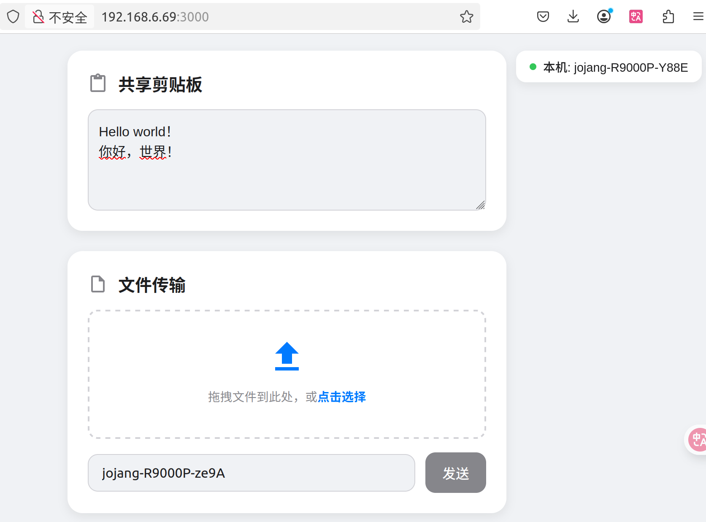
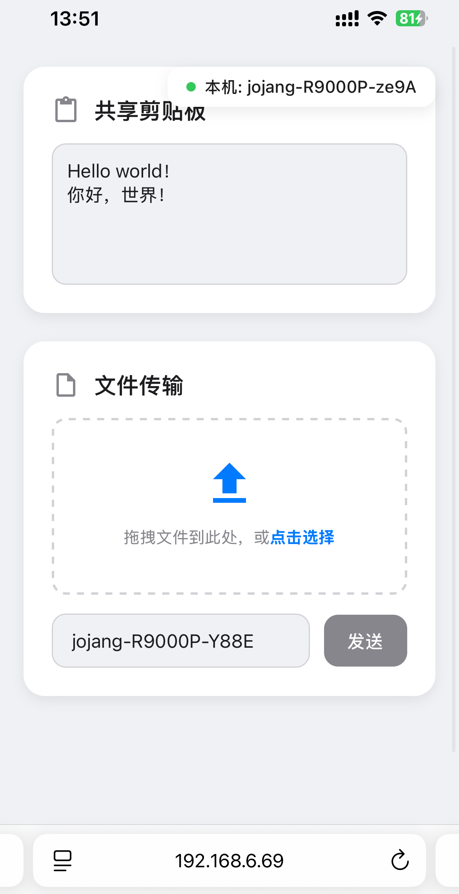

# AirDrop Web

<div align="center">
  🌐 <a href="./README_CN.md">中文说明</a> | <strong>English</strong>
</div>

<div align="center">
<table>
  <tr>
    <td align="center">
      <strong>Desktop (Ubuntu)</strong><br>
      
    </td>
    <td align="center">
      <strong>Mobile (iPhone)</strong><br>
      
    </td>
  </tr>
</table>
</div>

---

A simple web-based local network file and clipboard sharing tool, inspired by [LocalSend](https://localsend.org/).  
No client installation is required — just open the web page on your devices and start sharing.

---

## ✨ Features

- **Clipboard Sharing**  
  Sync text and images between devices in real time.

- **File Transfer**  
  Drag & drop or select files, then send to a specific device.

- **Automatic Device Discovery**  
  Detects and shows all devices currently connected.

- **Cross-Platform**  
  Works on any device with a modern browser (Windows, macOS, Linux, Android, iOS).

---

## 🚀 Getting Started

### Prerequisites
- [Node.js](https://nodejs.org/) (v14+ recommended)

### Installation & Running
```bash
npm init -y
npm install express socket.io multer
node server.js
