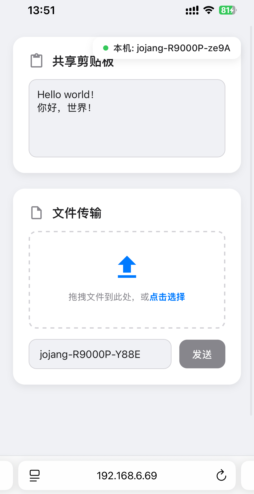

# AirDrop Web

<div align="center">
  🌐 <strong>中文说明</strong> | <a href="./README.md">English</a>
</div>

<div align="center">
<table>
  <tr>
    <td align="center">
      <strong>桌面端 (Ubuntu)</strong><br>
      
    </td>
    <td align="center">
      <strong>移动端 (iPhone)</strong><br>
      
    </td>
  </tr>
</table>
</div>

---

一个受 [LocalSend](https://localsend.org/) 启发的网页版局域网文件与剪贴板共享工具。  
无需在设备上安装客户端，只需在浏览器中打开网页即可使用。

---

## ✨ 功能特性

- **剪贴板共享**  
  支持跨设备实时同步文本与图片。

- **文件传输**  
  支持拖拽或选择文件，并发送到指定设备。

- **设备自动发现**  
  自动检测并列出所有已连接的设备。

- **跨平台**  
  适用于任何带现代浏览器的设备 (Windows, macOS, Linux, Android, iOS)。

---

## 🚀 快速开始

### 环境准备
- 确保已安装 [Node.js](https://nodejs.org/) (建议 v14 或更高版本)

### 安装与运行
```bash
npm init -y
npm install express socket.io multer
node server.js
